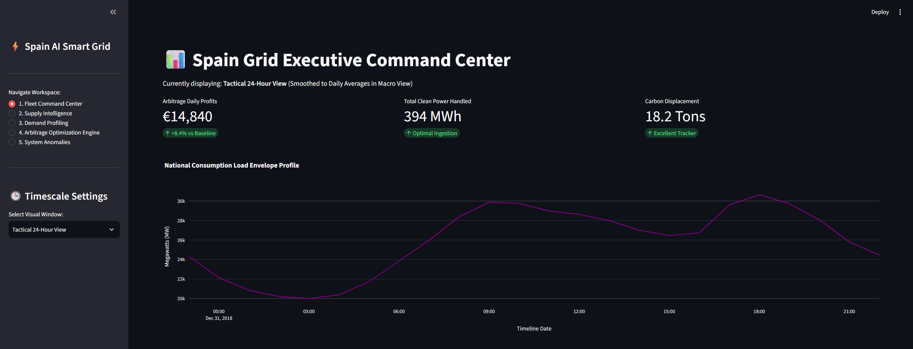
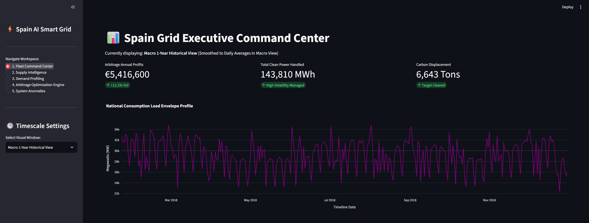
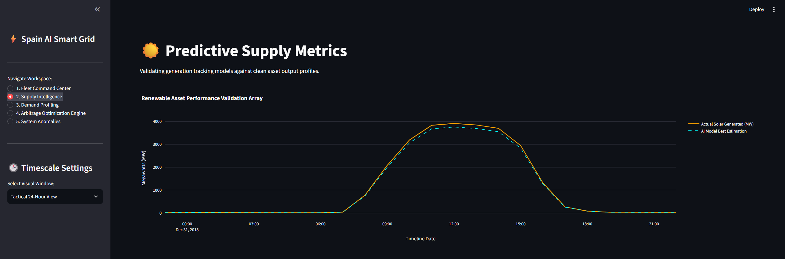
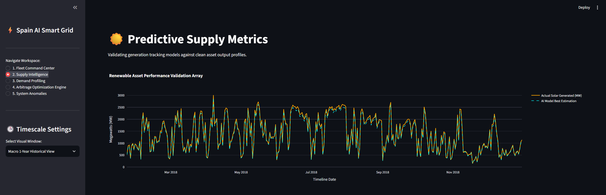
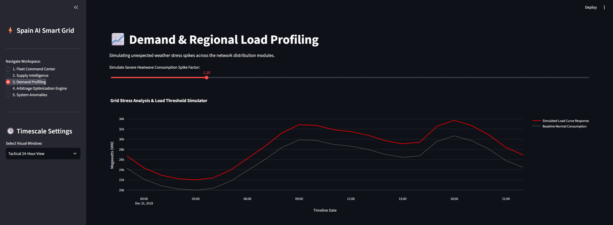
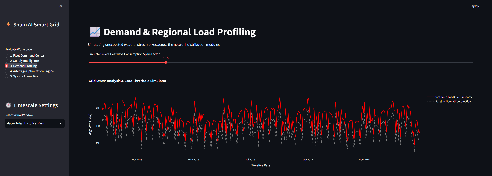
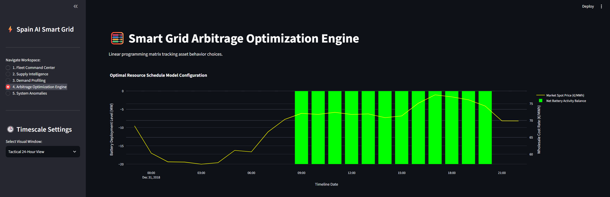
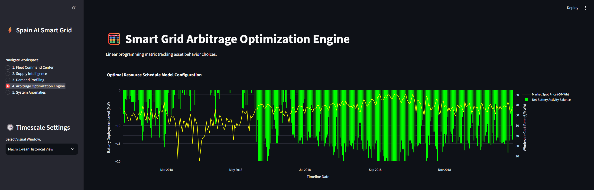
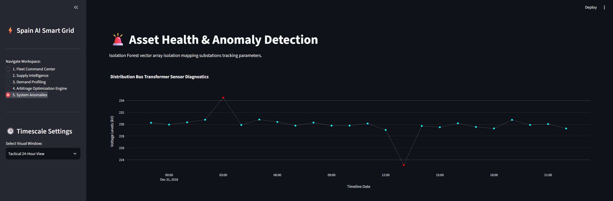
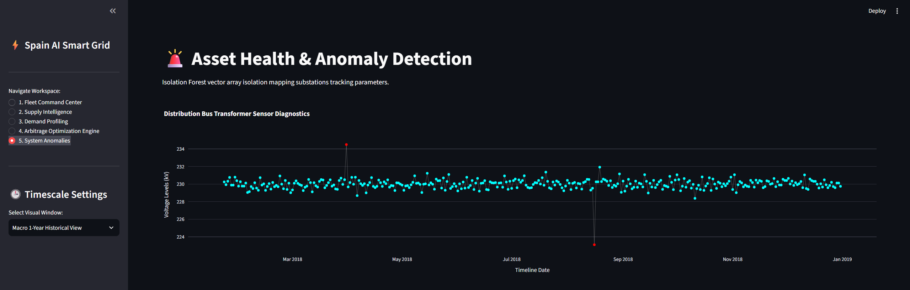

# Spain Smart Grid Analytics & Battery Arbitrage Engine

[🌐 Launch Live Interactive Dashboard](https://spain-smart-grid-ai.streamlit.app/) | [📄 View Architecture Documentation](#-core-architecture)

This repository contains an end-to-end simulation framework that bridges time-series machine learning forecasting with linear programming optimization. The application ingests public historical grid data from the Spanish market (REE), uses gradient boosting to predict market conditions, and routes those constraints to an operations research engine optimizing a virtual grid-scale energy storage asset.

## 🖼️ Dashboard Preview & Feature Gallery

### Group 1: Fleet Command Center (KPI Overview)
*Left: Tactical 24-Hour Operations | Right: Macro 1-Year Financial/Power Trends*



### Group 2: Supply Intelligence & Solar Forecasting (ML Metrics)
*Left: Day-Ahead Generation Profile (AI Validation) | Right: Full-Year Solar Capacity Matrix*



### Group 3: Demand Profiling & Heatwave Simulations (Stress Test)
*Left: Peak-Day Load Envelope Profiling | Right: Downsampled Year Grid Thresholds*



### Group 4: Arbitrage Optimization Engine (Linear Programming)
*Left: Maximum 24h Dispatch Decision Matrix | Right: Multi-Period Market Price Boundaries*



### Group 5: Asset Health & Anomaly Detection (Isolation Forest)
*Left: Real-Time Transformer Voltage Spike Logs | Right: Structurally Downsampled Annual Asset Logs*



## 📊 Core Architecture
The system is built in a modular Python framework divided into separate executable execution layers:
* `data_pipeline.py`: Ingests raw electrical grid loads, filters tracking duplicates, and aligns timestamps across various data streams.
* `train_models.py`: Handles feature engineering, then trains and serializes dual XGBoost models to forecast grid load and solar generation profiles.
* `optimizer.py`: Formulates a linear programming matrix using the SciPy HiGHS optimization engine to compute maximum revenue dispatch curves.
* `app.py`: A Streamlit multi-page interface tracking both 24-hour tactical views and 1-year macro historical trends.

> **Data Scoping Note:** While the electrical infrastructure baseline (load, generation mixes, and spot pricing) reflects the entire Spanish national grid managed by Red Eléctrica de España (REE), local weather attributes are indexed strictly to Madrid coordinates. This functions as a centralized macroeconomic proxy, maintaining high forecasting correlation while bypassing redundant database dimension expansion.

## ⚡ Key Technical Insight: Optimization Boundaries vs. Asset Physics
When exploring the **Arbitrage Optimization Engine** dashboard tabs, a clear architectural artifact is visible: the virtual battery asset pins aggressively to maximum discharge (`-20 MW`) during market price spikes but remains idle at `0 MW` (standby) during cheaper pricing valleys instead of actively charging.

### Why this happens:
This behavior is the mathematically normal output of a cost-minimizing linear programming solver operating under unlinked hourly boundary constraints. Because the engine splits its parameters dynamically via a daily median pricing line, it registers that choosing a positive charging action (`+20 MW`) introduces an immediate cost to the objective function, whereas selecting a standby value (`0 MW`) costs nothing. Since the matrix doesn't feature a continuous, time-linked capacity constraint vector across periods, the solver selects the greediest mathematical path to avoid upfront costs while capitalizing on free discharge revenue.

### The Engineering Roadmap:
To scale this codebase from an MVP prototype to a physical simulation tool, the next sprint involves adding a multi-period **State-of-Charge (SoC)** tracking inequality system ($SoC_{t} = SoC_{t-1} + X_t$). This adjustment links the time blocks together, forcing the optimizer to accept purchasing costs during valleys to unlock discharge capacities during peaks.

## 🛠️ Technology Stack
* **Frontend Dashboard:** Streamlit, Plotly
* **Analytics Engine:** Pandas, NumPy
* **Machine Learning:** XGBoost, Scikit-Learn
* **Mathematical Optimization:** SciPy (`scipy.optimize.linprog` using the HiGHS solver)

## 💻 Running the App Locally
1. Clone the repository and navigate into the folder.
2. Install the requirements: `pip install pandas numpy xgboost scipy streamlit plotly`
3. Execute the full generation loop:
   ```bash
   python data_pipeline.py
   python train_models.py
   python -m streamlit run app.py
